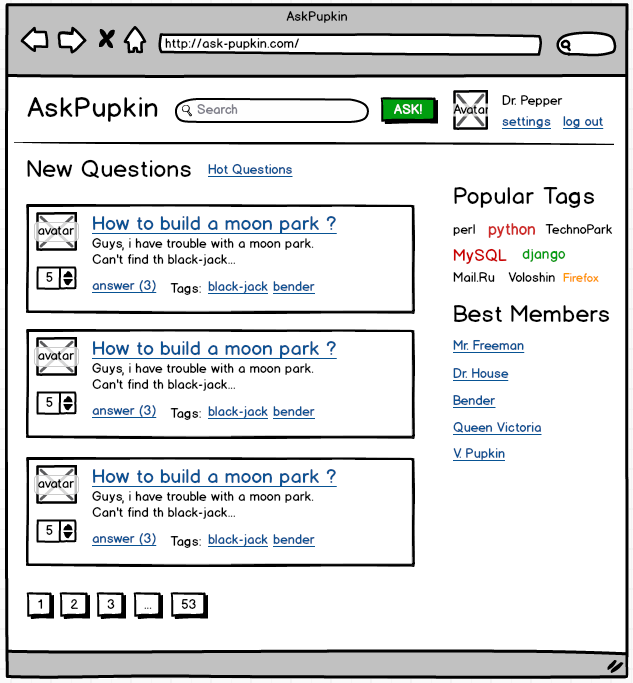

# Домашнее задание 1

## Верстка статического сайта
Целью домашнего задания является подготовка статический верстки сайта (так называемой «рыбы»). Верстку можно размещать в обычных html файлах, в директории public. Также возможно сразу размещать верстку в шаблонах Django. Во втором случае понадобится создать примитивные view и роутинг в urls.py самостоятельно. Подробнее работа с роутингом и шаблонизацей обсуждается в ДЗ2.

### 1. Верстка общего вида (layout) страницы
В файле **base.html** нужно создать основную верстку (любой) страницы. Для упрощения задачи нужно скачать и использовать CSS библиотеку [Bootstrap](https://getbootstrap.com/docs/5.2/getting-started/introduction/). Файлы (как свои CSS стили, так и файлы Bootstrap) нужно разместить в директории static.

При верстке страницы важно обратить внимание на:

- Терпимые отступы (padding/margin) между блоками;
- Юзерблок в шапке (для авторизованного и неавторизованного пользователя);
- Поисковая строка и логотип;
- Блоки в правой колонке.

### 2. Верстка списка вопросов на главной странице
В файле **index.html** нужно создать верстку для списка вопросов. Основную верстку (layout) можно просто скопировать из **base.html**. При использовании шаблонизатора - вам необходимо унаследовать ([extends](https://docs.djangoproject.com/en/4.1/ref/templates/builtins/#std:templatetag-extends)) шаблон от базового.

Обратить внимание на:

- Терпимые отступы (padding/margin) между блоками;
- Аватарки;
- Кнопки лайков;
- Тэги, счетчики ответов, остальные ссылки;
- Пагинатор (список номеров страниц).

### 3. Верстка страницы одного вопроса
HTML разместить в файле **question.html**.

Обратить внимание на:

- Список тегов у вопроса;
- Листинг ответов по верстки аналогичен листингу вопросов;
- Пагинатор ответов (список номеров страниц).

### 4. Верстка формы добавления вопроса
HTML разместить в файле **ask.html**.

Обратить внимание на:

- **Вывод сообщения об ошибках формы и подсказок к полям**. В верстке должны отображаться ошибки, чтобы было понятно как они сверстаны. Можно найти пример на макетах ниже;
- Ширину полей ввода;
- Максимальную длину полей ввода.

### 5. Верстка форм логина и регистрации
HTML разместить в файлах **login.html** и **signup.html** соответственно.

Обратить внимание на:

- **Вывод сообщения об ошибках формы и подсказок к полям**. В верстке должны отображаться ошибки, чтобы было понятно как они сверстаны. Можно найти пример на макетах ниже;
- Ширину полей ввода;
- Максимальную длину полей ввода.

### 6. Примерный внешний вид страниц

#### 6.1. Страница листинга вопросов

  

#### 6.2. Страница добавления вопроса

  

#### 6.3. Страница одного вопроса

  

#### 6.4. Страница листинга вопросов по тегу

  

#### 6.5. Страница пользователя с настройками

  

#### 6.6. Форма авторизации

  

#### 6.7.  Форма регистрации

  

Подробное описание страниц и блоков в [техническом задании](technical_details.pdf).

### 7. Баллы

#### Максимальные баллы за ДЗ - 16 баллов

Верстка общего вида (layout) страницы - 4:

- общий вид: 2 колонки, header, footer - 1;
- правая колонка - 1;
- блок авторизованного юзера - 1;
- поисковая строка и логотип - 1.

Верстка листинга вопросов - 3:

- общий вид (паддинги, аватарка) - 1;
- кнопки лайков - 1;
- теги, счетчики ответов, остальное - 1.

Верстка страницы вопроса - 3:

- общий вид - 1;
- чекбокс “правильный ответ”, кнопки лайков - 1;
- форма ответа - 1.

Верстка формы добавления вопроса - 3:

- общий вид - 2;
- сообщения об ошибках - 1.

Верстка форм логина и регистрации - 3:

- общий вид - 2;
- аватарка и сообщения об ошибках - 1.

### 8. Полезные ссылки
- Общая информация про [Bootstrap](https://getbootstrap.com/docs/5.2/getting-started/introduction/);
- [Сетка Bootstrap](https://getbootstrap.com/docs/5.2/layout/grid/);
- [Готовые блоки в Bootstrap](https://getbootstrap.com/docs/5.2/components/);
- [Верстка форм в Bootstrap](https://getbootstrap.com/docs/5.2/forms/overview/);
- [Основы шаблонизатора Django](https://docs.djangoproject.com/en/4.1/ref/templates/language/);
- [Как отрисовать шаблон](https://docs.djangoproject.com/en/4.1/topics/http/shortcuts/#render).
